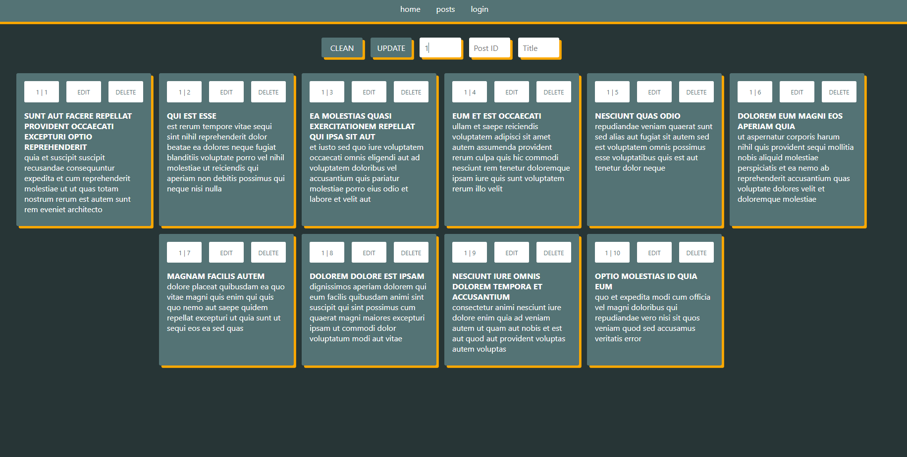
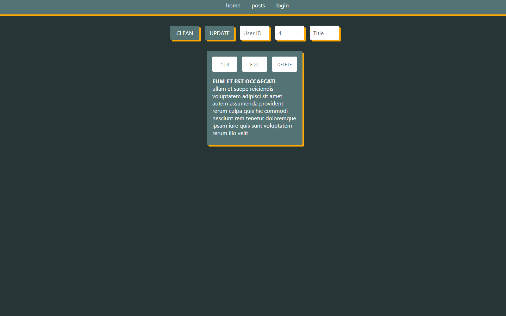
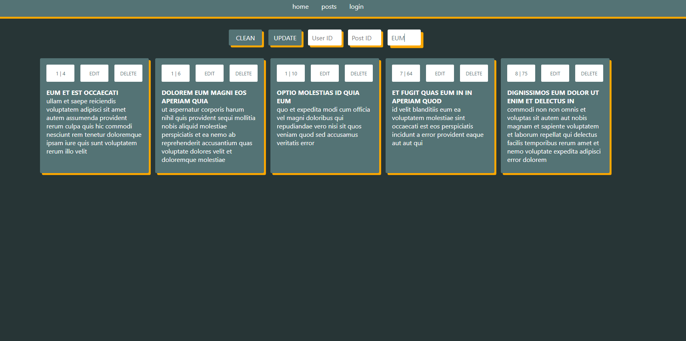
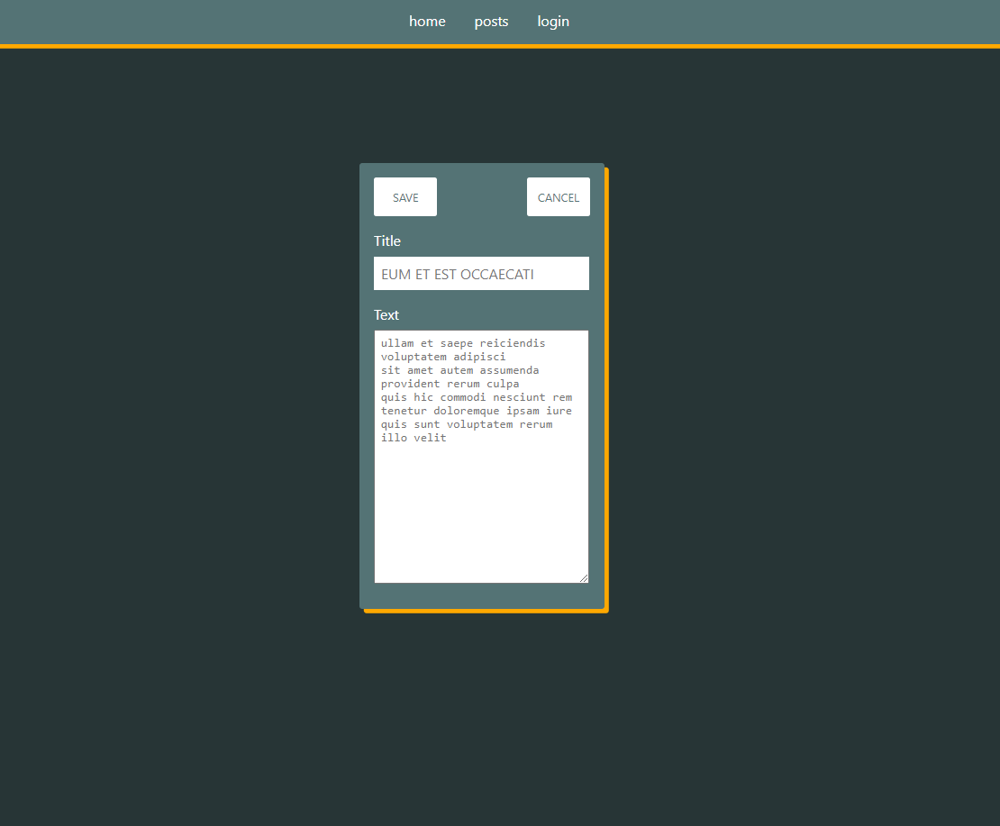

# CLEVERPY TEST

Prueba técnica Front-End para Cleverpy. 
Tiempo de trabajo: 16 horas aprox. 
Handicaps: Aprender Typescript en el proceso.

 

## Instalación:

1. Descomprime el fichero zip.
2. Abre la carpeta dentro del fichero con tu editor favorito.
3. Ejecuta 'npm i' para installar las dependencias.
4. Ejecuta 'npm start' y espera a que se abra en tu explorador.

 

## Características

1. React-router-Dom 
2. SCSS y variables
3. NavBar
4. Animaciones
5. Paleta de colores
6. Flexbox
7. Responsive

 

## Funcionalidades

Para acceder a los posts hay que loguearse usando los credentials:
Email: admin@gmail.com 
password: admin

Es algo básico y sencillo sin ningún tipo de protección. Para montar una buena seguridad habría que montar un backend y hashear la clave ahí.

1. Visor de todos los pots

Pulsa el botón GET para obtener los posts de la API.

  

2. Filtro de posts por User ID

  

3. Filtro de posts por ID

  

4. Filtro de posts por TITLE

  

5. Edición de posts

  

6. Eliminación de posts:

Para eliminar un post sólo hay que pulsar en el botón DELETE del mismo post. 

A la hora de visualizar el borrado del post en pantalla habrá que darle a UPDATE en el menú. Podría hacerse de forma directa pero tal como está concebido el filtro de posts es mejor hacerlo así. 

  

7. REDUX

No he visto la necesidad de usar REDUX para lo que se estaba pidiendo. A priori no era la mejor opción como bien estaba especificado en el pdf. De todas maneras como ampliación de la prueba lo he intentado aplicar para el login y aunque en javascript suelo usar redux sin ningún problema, la implementación me ha dado muchos problemas seguramente por mi falta de experiencia con typescript.He terminado por desmontar todo el sistema de redux que había creado ya que me almacenaba la información pero luego no podía extraerla adecuadamente.
  
P.D. He dejado la carpeta redux y las dependencias instaladas pero no hago uso de ello.

